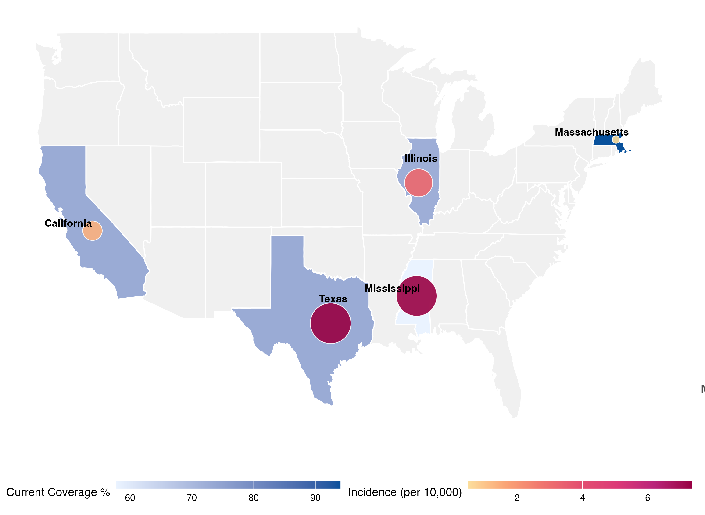

# Estimated Impacts of Rotavirus Vaccine Guideline Changes in the U.S. 

MATLAB code for the transmission dynamic model and R code for downstream analyses and figures in the manuscript.



## Repository structure

```
manuscript_repo/
├── main_model.m            # Transmission dynamic model (entry point)
├── ode_equations.m         # ODE system for the transmission model
├── model_input_data.mat    # Input data for the MATLAB model
├── figure_1A.R             # Fig 1A: US-level projection plot (4 coverage scenarios)
├── figure_1B.R             # Fig 1B: Waffle plot of averted hospitalizations
├── figure_2A_2B.R          # Fig 2A & 2B: State-level map + dot plot
├── supplemental_figure_1.R # Supp Fig 1: 94%-scaled coverage scenario
├── supplemental_figure_state.R  # Supp Fig: state-level projections (CA, IL, MA, MS, TX)
├── final_dataset/                  # ⚠️ Embargoed — available upon publication
│   ├── 9final_results_Mar_7.xlsx   # Model output (US + state sheets)
│   └── 9pop_results_Mar_7.xlsx     # Under-5 population estimates
└── figures/                        # Rendered figure outputs (generated by scripts)
```

## Workflow

The analysis pipeline runs in two stages:

1. **MATLAB (transmission dynamic model):** `main_model.m` runs the age-structured transmission model using `ode_equations.m` and `model_input_data.mat`, generating projected RVGE hospitalization counts under each vaccine coverage scenario. Outputs are saved to `final_dataset/`.
2. **R (visualization):** The R scripts read model outputs from `final_dataset/` and produce all manuscript figures.

## Usage

### MATLAB
Run `main_model.m` from the repo root in MATLAB. Requires `model_input_data.mat` in the same directory.

### R
Open the project in RStudio (or run scripts from the repo root) so that relative
paths (`./final_dataset/...`) resolve correctly. Run each script independently;
they share no cross-script dependencies.

### Required R packages

```r
install.packages(c(
  "ggplot2", "dplyr", "tidyr", "readxl", "lubridate",
  "purrr", "ggpubr", "waffle", "ragg", "patchwork",
  "forcats", "ggnewscale", "maps", "ggrepel", "stringr"
))
```

## Coverage scenarios

| Label | Description |
|---|---|
| `Cov_60` | 60% vaccine coverage |
| `Cov_40` | 40% vaccine coverage |
| `Cov_20` | 20% vaccine coverage |
| `cov_50_rela` | 50% of current state baseline coverage |
| `cov_94_scaled` | 94% coverage (scaled from MA) |

## Date windows

- **Historical**: 2023-07-01 – 2025-06-30
- **Projection**: 2027-07-01 – 2029-06-30
